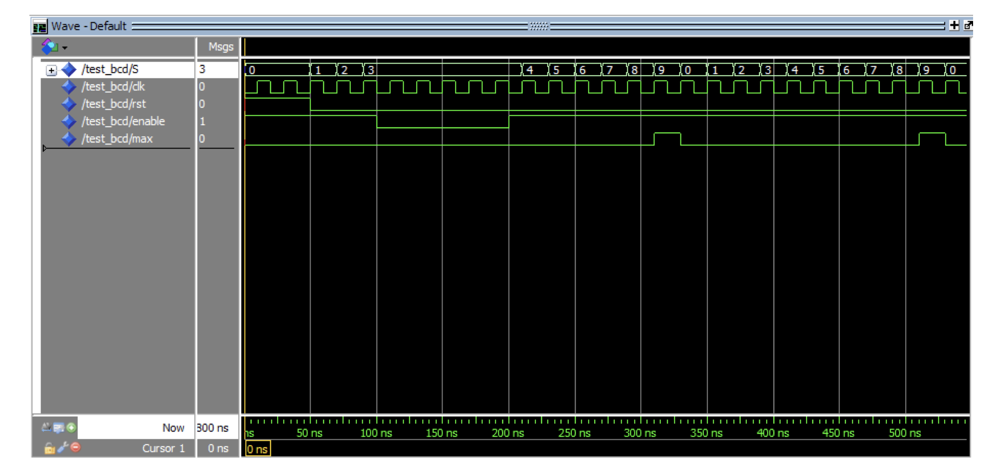
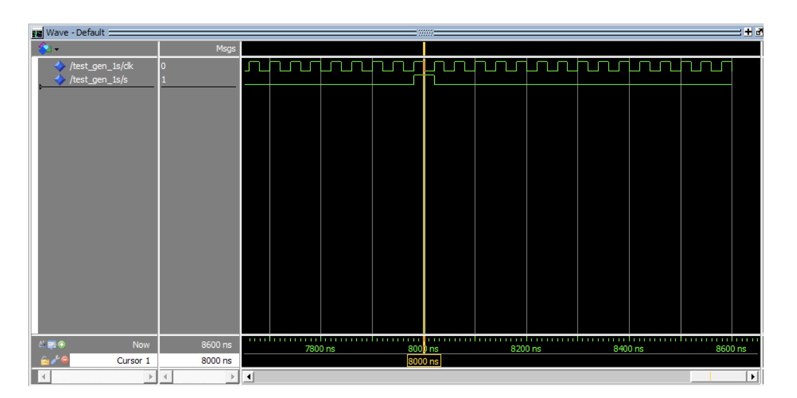
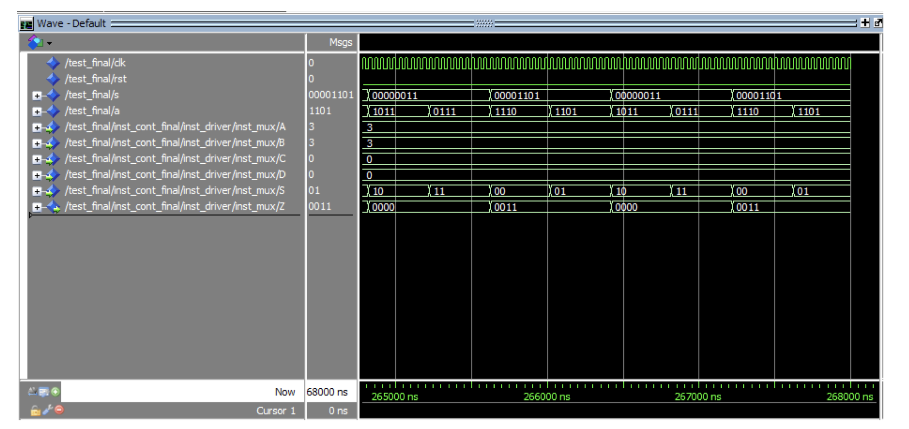

# 4-digits-bcd-counter

A project from Digital Systems at FIUBA University which aims to use basic concepts in order to implement a 4 digits BCD counter
in a Xilinx board called __"Spartan 3 Starter Board"__.

## Implementation

The project consists of two parts.
Firstly, a module of 4 BCD counters have been implemented along with
an enable generator to reduce the clock frequency which is at 50 MHz.

### 4 bits counter

Each counter is implemented with a flip flip D. 
Each FF has a clock input so the counters are synchronized.

### Enable generators

The enable generators blocks were designed to divide the frequency and have been implemented to establish a counting speed for the counters.
In this work one has been implemented so the first BCD counter to count every 1 second and the other generator with a frequency of 200 Hz. Thus, multiplexing the output of the four meters and turning on the display, whose speed is sufficient to fool the naked eye and see the 4 LEDs 7 segments lit at once.
The Figure shows the simulation of the enable generator.
The frequency is adapted to visualize in the simulation its correct operation.

### 7 Segments driver

At this stage as mentioned in previous points, different blocks were implemented, such as the multiplexer, 2-bit counter, two decoders from 2 to 4 and 4 to 8 for the anodes and inputs of the display respectively.
Additionally, the 200 Hz enable generator showed previously.

- Multiplexer: this block has been implemented with two control inputs and four inputs to multiplex with a single output.

- Decoders: the decoders were implemented through logical functions, that is, the respective Karnaugh maps were previously made. 
However, implemented this way the code only serves for this particular case from 2 to 4 and 4 to 8.
Thus, it is not reusable.

- 2-bit Counter: this BCD counter was implemented in the same way as 4-bit BCD counters.

## Simulation

All modules connected are shown in the following picture.

